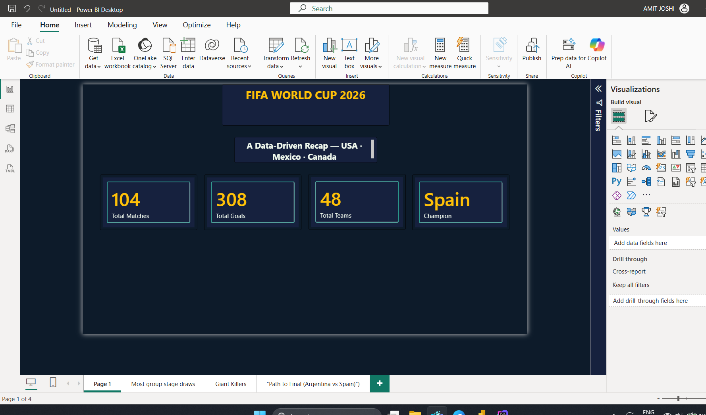

# FIFA World Cup 2026 Analytics

## Project Overview

This project analyzes FIFA World Cup 2026 data using an end-to-end data analytics workflow. The project combines API-pulled CSV datasets, SQL analysis, Python analysis, Power BI visualization, and Excel-based data preparation.

The objective is to collect structured football data, prepare it, analyze it, and present useful insights through different analytics tools.

## Workflow

**API Data → CSV → Data Cleaning / Preparation → SQL Analysis → Python Analysis → Power BI Visualization → Insights**

## Dataset

The data was pulled through an API and stored as separate CSV files rather than one Excel workbook.

The `data` folder contains:

- [`games_live.csv`](data/games_live.csv) - game/match-related data
- [`groups_live.csv`](data/groups_live.csv) - group-stage information
- [`stadiums_live.csv`](data/stadiums_live.csv) - stadium information
- [`teams_live.csv`](data/teams_live.csv) - team information

## Tools & Technologies

- **Python** - data analysis and scripting
- **SQL / MySQL** - querying and analytical analysis
- **Power BI** - visualization and dashboarding
- **Microsoft Excel** - data cleaning, lookup functions, Pivot Tables, and supporting analysis
- **GitHub / GitHub Desktop** - version control and project documentation
- **API** - data retrieval

## SQL Analysis

The SQL component ([`worldcup2026.sql`](data/sql/worldcup2026.sql)) contains queries used to explore and analyze the collected FIFA World Cup data.

The SQL workflow includes:

1. Loading CSV data into the database
2. Inspecting tables and columns
3. Filtering records
4. Aggregating data
5. Joining related datasets
6. Grouping and summarizing results
7. Extracting analytical insights

Key SQL concepts include:

- `SELECT`
- `WHERE`
- `GROUP BY`
- `ORDER BY`
- `HAVING`
- `JOIN`
- `COUNT()`
- `SUM()`
- `AVG()`

## Python Analysis

Python ([`live_wc_pull_no_pandas.py`](data/sql/python/live_wc_pull_no_pandas.py)) was used as part of the analytical workflow to work with the collected datasets.

The Python work includes:

- Loading CSV datasets
- Inspecting data
- Data preparation
- Basic analysis
- Generating analytical outputs

## Power BI

The Power BI project file is [`Fifa worldcup project.pbix`](<data/sql/python/powerbi/Fifa worldcup project.pbix>).

Power BI was used to turn the prepared data into visual insights.

The workflow includes:

1. Importing prepared data
2. Preparing fields
3. Creating visualizations
4. Building an interactive report/dashboard
5. Communicating findings through visuals

### Dashboard Screenshot



Full-size image: [`Dashboard1.png`](data/sql/python/powerbi/documentation/screenshots/Dashboard1.png)

More detail: [`documentation/README.md`](data/sql/python/powerbi/documentation/README.md)

## Excel

Excel was used for data preparation and supporting analysis.

Techniques include:

- Data cleaning
- Standardizing records
- Sorting and filtering
- `XLOOKUP` / `VLOOKUP`
- `IF`
- `COUNTIF`
- `SUMIF`
- `SUM`
- `COUNT`
- `AVERAGE`
- Pivot Tables

## Repository Structure

```text
fifa-world-cup-2026-analytics/
├── README.md
└── data/
    ├── games_live.csv
    ├── groups_live.csv
    ├── stadiums_live.csv
    ├── teams_live.csv
    └── sql/
        ├── worldcup2026.sql
        └── python/
            ├── live_wc_pull_no_pandas.py
            └── powerbi/
                ├── Fifa worldcup project.pbix
                └── documentation/
                    ├── README.md
                    └── screenshots/
                        └── Dashboard1.png
```

> Note: the SQL, Python, and Power BI work sit nested inside `data/` (not as separate top-level folders) — `data/sql/` holds the SQL file, `data/sql/python/` holds the Python script, and `data/sql/python/powerbi/` holds the Power BI file and its own documentation folder.

## Key Components

| Component | Technology | File |
|---|---|---|
| Data Collection | Python | [`live_wc_pull_no_pandas.py`](data/sql/python/live_wc_pull_no_pandas.py) |
| Match Data | CSV | [`games_live.csv`](data/games_live.csv) |
| Group Data | CSV | [`groups_live.csv`](data/groups_live.csv) |
| Stadium Data | CSV | [`stadiums_live.csv`](data/stadiums_live.csv) |
| Team Data | CSV | [`teams_live.csv`](data/teams_live.csv) |
| SQL Analysis | SQL | [`worldcup2026.sql`](data/sql/worldcup2026.sql) |
| Dashboard | Power BI | [`Fifa worldcup project.pbix`](<data/sql/python/powerbi/Fifa worldcup project.pbix>) |
| Dashboard Screenshot | PNG | [`Dashboard1.png`](data/sql/python/powerbi/documentation/screenshots/Dashboard1.png) |
| Documentation | Markdown | [`documentation/README.md`](data/sql/python/powerbi/documentation/README.md) |

## Key Learning Outcomes

This project demonstrates practical experience with:

- API-based data retrieval
- Working with multiple CSV datasets
- Data cleaning and preparation
- SQL querying and analysis
- Python-based data analysis
- Power BI visualization
- Excel analytical techniques
- Organizing an analytics project using GitHub

## How to Use

1. Clone or download the repository.
2. Review the CSV datasets in [`data/`](data/).
3. Use [`worldcup2026.sql`](data/sql/worldcup2026.sql) in `data/sql/` for database analysis.
4. Run [`live_wc_pull_no_pandas.py`](data/sql/python/live_wc_pull_no_pandas.py) from `data/sql/python/`.
5. Open [`Fifa worldcup project.pbix`](<data/sql/python/powerbi/Fifa worldcup project.pbix>) from `data/sql/python/powerbi/`.
6. Review [`data/sql/python/powerbi/documentation/`](data/sql/python/powerbi/documentation/) for the dashboard screenshot and detailed notes.

## Project Purpose

This repository serves as a portfolio project demonstrating an end-to-end business/data analytics workflow using structured football data and commonly used analytics tools.
